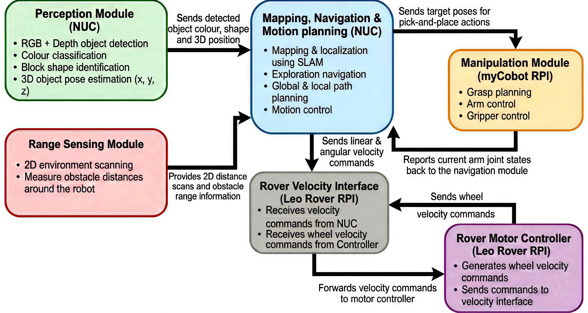

# AERO62520: Team 4 (2025/26)

This GitHub organization contains all the software used by Team 4 for the Robotic Systems Design Project (MSc Robotics 2025/26) at the University of Manchester.

## Main Repos
- [nuc_ws](https://github.com/Team4-UoM-RSDP/nuc_ws) - The main ROS2 workspace for the NUC, used to orchestrate the mission.
- [cobot_ws](https://github.com/Team4-UoM-RSDP/cobot_ws) - A ROS2 workspace for the myCobot 280pi, executing incoming joint and gripper commands, and following MoveIt2 trajectories from the NUC.
- [rover_ws](https://github.com/Team4-UoM-RSDP/rover_ws) -  A ROS2 workspace for the Leo Rover v1.8, executing incoming velocity commands from the NUC.
- [mission_sim](https://github.com/Team4-UoM-RSDP/mission_sim) - Gazebo Harmonic simulation of the robot and mission.
- [rvm_evidence](https://github.com/Team4-UoM-RSDP/rvm_evidence) - The Requirements Verification Matrix (RVM) and supporting evidence.
- [design_files](https://github.com/Team4-UoM-RSDP/design_files) - CAD files produced for the project.

## Software Block Diagram

## Team 4
- [Lang Cheng](https://github.com/langchengg)
- [Ling Feng](https://github.com/lingfeng0219)
- [Chenyang Lai](https://github.com/ayanamislover)
- [Bertie Naivalurua](https://github.com/bt-nav)
- [Stanley Simpson](https://github.com/stasim-sudo)

###### Team 4 – AERO62520 Robotic System Design Project 
